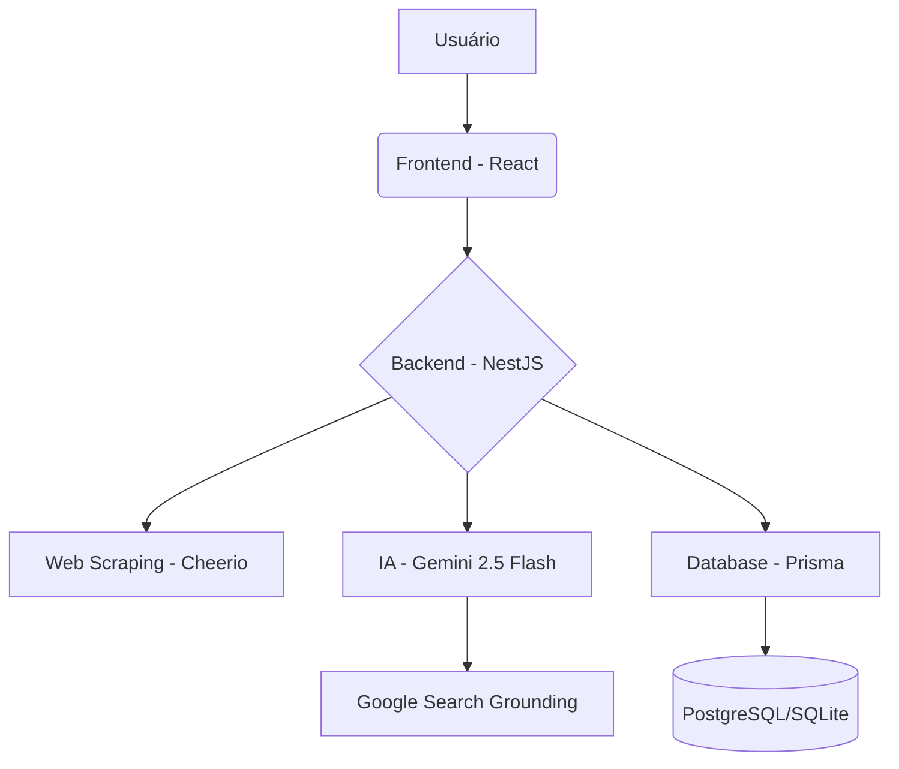

# 🛡️ Fake News Analyzer

[](https://opensource.org/licenses/MIT)
[](https://nestjs.com/)
[](https://reactjs.org/)
[](https://deepmind.google/technologies/gemini/)

O **Fake News Analyzer** é uma plataforma inteligente projetada para combater a desinformação em tempo real. Utilizando tecnologias de ponta em Inteligência Artificial, a aplicação analisa links de notícias e imagens para verificar a veracidade das informações, fornecendo um veredito detalhado e embasado.

---

## ✨ Funcionalidades Principais

- **🔗 Análise de Links**: Extração automática de conteúdo de artigos e notícias para verificação factual.
- **🖼️ Análise Multimodal (Imagens)**: Upload de prints ou fotos contendo notícias para análise via OCR e visão computacional.
- **🔍 Grounding com Google Search**: Integração em tempo real com a busca do Google para verificar fatos atuais e eventos recentes.
- **📊 Veredito Detalhado**: Classificação clara (Verdadeiro, Falso, Parcialmente Verdadeiro, etc.) com explicações lógicas e nível de confiança.
- **🚀 Compartilhamento**: Geração de links únicos para compartilhar os resultados das análises.

---

## 🛠️ Tecnologias e Técnicas Utilizadas

### Backend (NestJS)
- **Gemini 2.5 Flash**: Modelo de IA de última geração para processamento de texto e imagem.
- **Google Search Grounding**: Técnica que permite à IA "ancorar" suas respostas em dados reais e atualizados da web.
- **Zod Guardrails**: Implementação de esquemas de validação rigorosos para garantir que a saída da IA seja sempre estruturada e previsível.
- **Prisma ORM**: Gerenciamento de banco de dados robusto e tipado.
- **Cheerio & Axios**: Web scraping otimizado para extração de conteúdo relevante de sites de notícias.

### Frontend (React + Vite)
- **TypeScript**: Garantia de tipo e robustez no desenvolvimento.
- **React Router**: Navegação fluida entre a busca e os resultados.
- **CSS Moderno**: Interface responsiva, limpa e focada na experiência do usuário (UX).

---

## 🏗️ Arquitetura do Sistema

A arquitetura segue o modelo Cliente-Servidor com foco em escalabilidade e separação de preocupações:

1.  **Client (Frontend)**: Interface Single Page Application (SPA) que se comunica via REST API com o backend.
2.  **Server (Backend)**: API robusta que coordena a extração de dados, orquestração da IA e persistência.
3.  **Database**: Cache e histórico de análises para performance e referência futura.
4.  **AI Layer**: Integração direta com os serviços do Google Generative AI para processamento cognitivo.



---

## 🚀 Como Executar

### Pré-requisitos
- Node.js (v18+)
- Docker e Docker Compose (opcional, para banco de dados)
- Chave de API do Google Gemini

### Passo a Passo

1.  **Clone o repositório**:
    ```bash
    git clone https://github.com/seu-usuario/fakeNewsAnalizer.git
    cd fakeNewsAnalizer
    ```

2.  **Configuração do Backend**:
    ```bash
    cd backend
    cp .env.example .env # Adicione sua GEMINI_API_KEY
    yarn install
    yarn migrate
    yarn dev
    ```

3.  **Configuração do Frontend**:
    ```bash
    cd ../frontend
    yarn install
    yarn dev
    ```

---

<p align="center">Desenvolvido com ❤️ para um mundo com mais fatos e menos fakes.</p>
